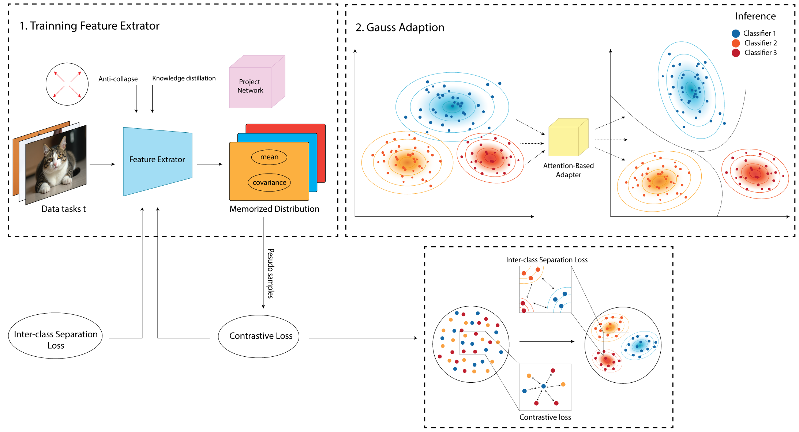

# AdaGauss+: Robust Feature Adaptation in Exemplar-Free Class Incremental Learning

## Overview

AdaGauss+ is an advanced method for Exemplar-Free Class Incremental Learning (EFCIL) that significantly improves upon the AdaGauss baseline. Our approach addresses key limitations in continual learning scenarios where models must learn new classes sequentially without storing previous task data.

### Key Contributions

- **Contrastive Loss with Pseudo-Prototypes**: Uses virtual exemplars sampled from memorized distributions to enhance feature discrimination
- **Attention-Based Adapter Network**: Employs attention mechanisms for nuanced, dimension-aware adaptation of past class distributions

## Method Architecture



Our method extends AdaGauss with three key components:
1. **Contrastive Learning**: Leverages pseudo-prototypes from past class distributions to maintain knowledge
2. **Attention-Based Adaptation**: Prioritizes important feature dimensions for more precise distribution transformation

## Setup

```bash
# Create conda environment
conda create -n adagauss_plus python=3.8
conda activate adagauss_plus

# Install dependencies
pip install -r requirements.txt
```

## Usage

### Training Configuration

```bash
# Train on CIFAR-100 with 10 tasks
bash scripts/cifar-10x10.sh 
# Train on TinyImageNet with 20 tasks
bash scripts/tiny-20x5.sh 
```
